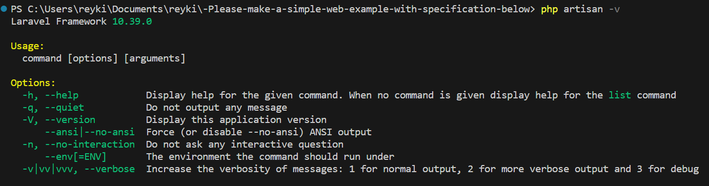
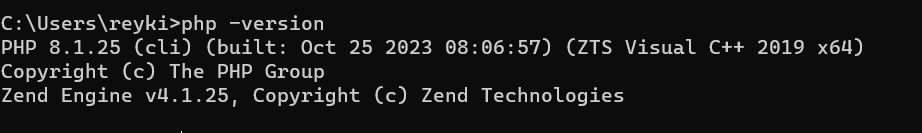
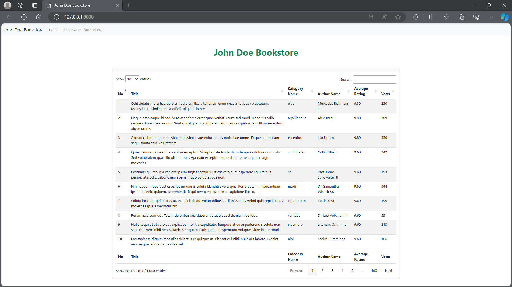
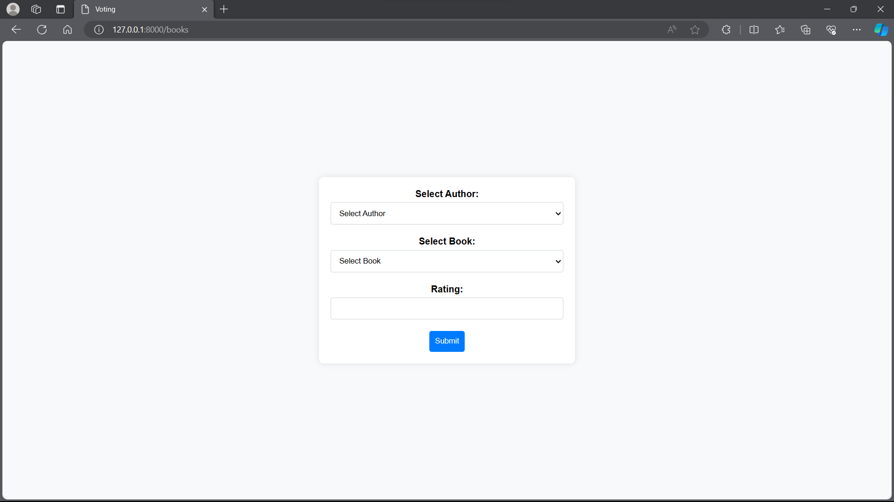

# Timedoor Backend Programming Exam 2024

### Project Test 

------

### Step by Step Installationrkjf


1. git clone  https://github.com/ReykiAS/-Please-make-a-simple-web-example-with-specification-below.git

2. import laravel sql to mysql application

3. Open the program file to code editor (VS Code)

4. Run composer install on your terminal VS Code

5. Copy .env.example file to .env on the root folder.

6. Open your .env file and change the database name (DB_DATABASE), username (DB_USERNAME) and password (DB_PASSWORD) field correspond to your configuration.

7. Run php artisan key:generate

8. Run php artisan serve

9. You can run the program

---

- Use Laravel 10

  

- Use Php Version 8.1



- [x] In this project please provide random of fake example data, you can use faker for this one. the data consist of

  - 1000 fakes author
  - 3000 fakes book category
  - 100.000 fakes books
  - 500.000 fakes rating

  To make 1000 fakes author data, 3000 fakes category, 100000 fakes books, and 500000 fakes rating, can use faker feature in laravel 

  - First of all I made database in mysql

  ```php
  <?php
  
  use Illuminate\Database\Migrations\Migration;
  use Illuminate\Database\Schema\Blueprint;
  use Illuminate\Support\Facades\Schema;
  
  class CreateBooksTable extends Migration
  {
      /**
       * Run the migrations.
       *
       * @return void
       */
      
      public function up()
      {
          Schema::create('books', function (Blueprint $table) {
              $table->id();
              $table->string('title');
              $table->integer('category_id');
              $table->integer('author_id');
              $table->integer('rating_id');
              $table->integer('voter');
  
  
              $table->timestamps();
          });
      }
  
      /**
       * Reverse the migrations.
       *
       * @return void
       */
      public function down()
      {
          Schema::dropIfExists('books');
      }
  }
  
  ```

  As describe in the code above, I made books table schema that will be migrated. In this project I need 4 tables

  | Authors |
  | :-----: |
  |  Books  |
  | Rating  |
  |  User   |

  In this four tables, seeding data dummy will be executed with the specified amount.  

  - Data dummy in laravel use factory feature which contains the desired columns.   

    ```php
    <?php
    
    namespace Database\Factories;
    
    use Illuminate\Database\Eloquent\Factories\Factory;
    
    class BooksFactory extends Factory
    {
        /**
         * Define the model's default state.
         *
         * @return array
         */
        protected $Books = Books::class;
        private static $counter = 1;
        public function definition()
        {
            return [
                'title' => $this -> faker -> text(),
                'category_id' => $this->faker->numberBetween(1, 3000),
                'author_id' => $this->faker->numberBetween(1, 1000),
                'rating_id'  => $this->numberIncrement(),
                'voter' => $this->faker->numberBetween(1, 500),
    
                    
            
            ];
        }
        private function numberIncrement()
        {
            return self::$counter++;
        }
       /*  private function numberIncrement2()
        {
            return self::$counter1++;
        } */
    }
    
    ```

    First I made class 'Books', then  inputed column names that I made before, in this code I use function 'numberBetween' to give random number between from 1 - 3000 according to the number of categories desired.

    - [x] List of books with filter

      

      

      In this List of Book I made data model that has the function to represent database tables. To make this data table I use this code:

      ```php
      <?php
      
      namespace App\Models;
      
      use Illuminate\Database\Eloquent\Factories\HasFactory;
      use Illuminate\Database\Eloquent\Model;
      
      class books extends Model
      {
          use HasFactory;
          protected $fileable = [
              'title',
              'category_id',
              'author_id',
              'rating_id',
              'voter',
      
          ];
      ```

      Protected $fileable is representation from database table that I have made before.  

      -  After making the data model, I made controller to show the data that I want to show. 

        ```php
      <?php
        
        namespace App\Http\Controllers;
        use App\Models\books;
        use Illuminate\Http\Request;
        use DB;
        
        class BooksController extends Controller
        {
            public function index(){
                $books = books::paginate(5);
        
                $books = DB::table('books')
                ->join('categories', 'books.category_id', '=', 'categories.id')
                ->join('authors', 'books.author_id', '=', 'authors.id')
                ->join('ratings', 'books.id', '=', 'ratings.books_id')
                ->groupBy('books.id', 'books.title', 'books.category_id', 'categoryName', 'authorName','books.author_id','books.rating_id','books.voter','books.created_at','books.updated_at')
                ->select('books.*', 'categoryName as category_name', 'authorName as author_name',\DB::raw('ROUND(AVG(ratings.rating), 2) as average_rating'))
                
                
                ->orderByDesc('average_rating')
                ->limit(65000)
                ->get();
        
                
                return view('welcome',['books' => $books]);
        
               
            }
        
        }
        
        ```
        
        In the query above is how to get data from database.  To view the data, I use limit 65000 data as a filter.  

        - After making the code in the controller, I made landing page inside the folder views and use route to get controller and show the website that I made.  

    - [x] List of top 10 most famous author, order by vote 

      ​		

​						To make the list of top 10 most famous author (order by vote), first I made the controller that can filter the largest 						number of votes that have a rating more than 5.   

```php
	<?php

namespace App\Http\Controllers;
use App\Models\books;
use Illuminate\Http\Request;
use DB;

class FamousController extends Controller
{
    public function index(){
        $famous = books::paginate(5);

        $books = DB::table('books')
        ->join('categories', 'books.category_id', '=', 'categories.id')
        ->join('authors', 'books.author_id', '=', 'authors.id')
        ->join('ratings', 'books.id', '=', 'ratings.books_id')
        ->groupBy('authors.id', 'authors.authorName')
        ->havingRaw('COUNT(books.voter) > 5')
        ->orderByDesc(\DB::raw('COUNT(books.voter)'))
        ->limit(10)
        ->select('authors.authorName as author_name', \DB::raw('COUNT(books.voter) as voter_count'))
        ->get();

        
        return view('famous',['books' => $books]);

       
    }
}

```

​				I use count for the rating column and grouping for books that have the rating more than 5, if it's fulfilled then i will limit 				to show only ten data.

- [x] Input rating

  ​						

​				To make input rating  the first thing I do is made to group books according to the author name. In this grouping I use controller and made this code. 

​	

```
<?php

namespace App\Http\Controllers;
use App\Models\books;
use App\Models\authors;
use Illuminate\Support\Facades\DB;
use Illuminate\Http\Request;

class RatingController extends Controller
{
    public function index()
{
    $authors = authors::all();
    $books = $this->getBooks(); 

    return view('books.index', compact('books', 'authors'));
}

public function filterBooksByAuthor($authorId)
{
    $books = $this->getBooks($authorId); 

    return response()->json($books);
}
private function getBooks($authorId = null)
{
    $query = DB::table('books')
        ->join('authors', 'books.author_id', '=', 'authors.id')
        ->join('ratings', 'books.id', '=', 'ratings.books_id')
        ->groupBy('books.id', 'books.title', 'books.category_id', 'authorName', 'books.author_id', 'books.rating_id', 'books.voter', 'books.created_at', 'books.updated_at')
        ->select('books.*', 'authorName as author_name');

    if ($authorId !== null) {
        $query->where('authors.id', $authorId);
    }

    return $query->get();
}
}

```

​	This function is use so that the data books can be filtered according to author id which is then converted into json. After the data book can be viewed, I made input file menu by adding this code into the controller file. 

```
public function giveRating(Request $request)
{
    $request->validate([
        'book_id' => 'required|exists:books,id',
        'rating' => 'required|integer|min:1|max:10',
    ]);

    $bookId = $request->input('book_id');
    $rating = $request->input('rating');

    DB::table('ratings')->updateOrInsert(
        ['books_id' => $bookId],
        ['rating' => $rating]
    );

    Books::where('id', $bookId)->increment('voter');
    

    return response()->json(['success' => true]);
}
```

The code above function as input data that has to go to validation data which include data validation stage using '$request->validate' then input data according to the destination id. To increase the number of votes, I use increment.  
